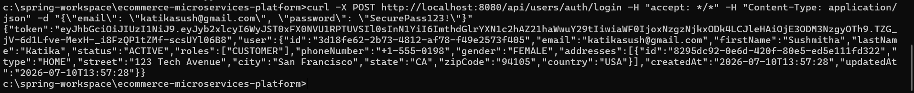

# E-Commerce Microservices Platform

Welcome to the **E-Commerce Microservices Platform**! This enterprise-grade repository showcases a highly decoupled, scalable, and event-driven backend architecture using Java Spring Boot.

## 📖 Deep-Dive Architecture & Project Guide
For a deep dive into how we orchestrated the Database-per-service pattern, implemented stateless JWT security at the Gateway level, and choreographed asynchronous Kafka events:

👉 **[Read the comprehensive E-Commerce Project Guide](PROJECT_GUIDE.md)**!

## 🏛 Architecture Diagram


## 📖 Deep-Dive Architecture Documentation
Our platform features an extensive `docs/` suite covering component interactions, database topologies, and sequence diagrams.
- [High-Level Architecture](docs/architecture/high-level.md)
- [Microservices Overview](docs/architecture/microservices.md)
- [Kafka Event Flow](docs/architecture/kafka.md)
- [Authentication Flow](docs/flows/authentication.md)
- [Order Processing Sequence](docs/flows/order-processing.md)
- [Database Architectures](docs/architecture/database.md)
- [Full API Reference](docs/api/endpoints.md)

## ⚙️ Installation & Local Setup

### Prerequisites
- JDK 17+
- Maven 3.8+
- Docker & Docker Compose

### 1. Start Infrastructure (Databases & Kafka)
```bash
docker-compose up -d
```

### 2. Build Microservices
The project includes a parent POM for convenient 1-click building.
```bash
mvn clean install -DskipTests
```

### 3. Run Services
You can run each Spring Boot application via your IDE or using the Maven wrapper:
```bash
mvn spring-boot:run -pl api-gateway
mvn spring-boot:run -pl user-service
# Repeat for other services
```

## 🐳 Docker Setup
The entire platform, including all microservices, the API Gateway, and the infrastructure (MySQL, Kafka, Zookeeper, Zipkin, Redis, and ELK stack), is fully containerized.
1. Start the entire environment with a single command:
```bash
docker-compose up -d --build
```
This will automatically build the images for all services and launch them alongside the required infrastructure.

## 🧪 Testing with Postman
We provide a complete automated testing suite inside the `postman/` directory.
1. Import `postman_collection.json` and `postman_environment.json` into Postman.
2. Select the **E-Commerce Local Env** environment.
3. Run the **Authentication > Login** request to automatically seed the `{{jwtToken}}` variable.
4. Execute the entire collection to simulate end-to-end user flows!

### Successful Postman Login Output


Read the full [Postman Testing Guide](postman/README.md).

## 🔮 Future Improvements
- Migrate from Docker Compose to a local Kubernetes (Minikube) deployment cluster.
- Integrate a frontend framework (e.g., React or Angular) to consume the APIs.

## 📄 License
This project is licensed under the MIT License.

## ✍️ Author
Designed and developed by **Sushmitha Katika**.
