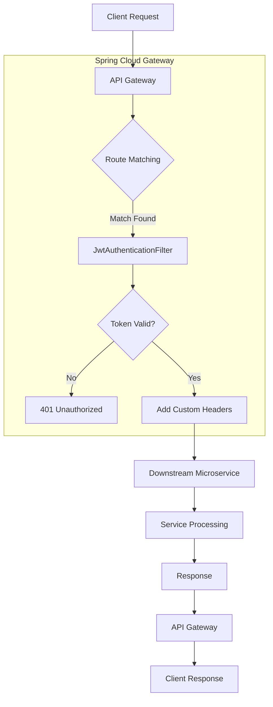

# API Gateway Architecture

The API Gateway acts as the single entry point and enforces security across all inbound traffic.

## Gateway Flow

### Flow Details
1. **Client Request**: An incoming HTTP request hits the Gateway.
2. **Route Resolution**: `application.yml` predicates determine the target service based on the path (e.g., `/api/products/**`).
3. **JWT Validation**: The custom `JwtAuthenticationFilter` intercepts the request and verifies the signature of the `Authorization` header.
4. **Request Forwarding**: Valid requests are passed to the downstream service.
5. **Response Flow**: The response is proxied back through the gateway to the client.
