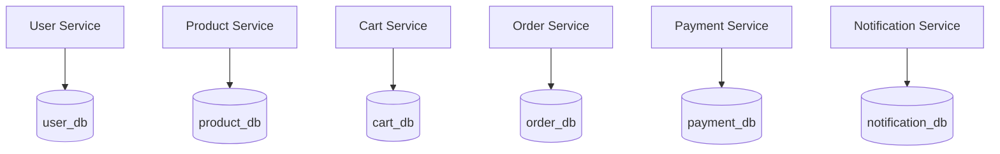

# Database Architecture

The platform strictly adheres to the **Database-per-Service** pattern.

## Why Database-per-Service?
1. **Loose Coupling**: A schema change in the `user_db` has zero impact on the `order-service`.
2. **Independent Scaling**: If `order_db` faces heavy I/O, it can be scaled or optimized independently from `notification_db`.
3. **Technology Agnostic**: While all current services use MySQL, future services could easily adopt NoSQL (e.g., MongoDB for Cart Service) without affecting the ecosystem.\n