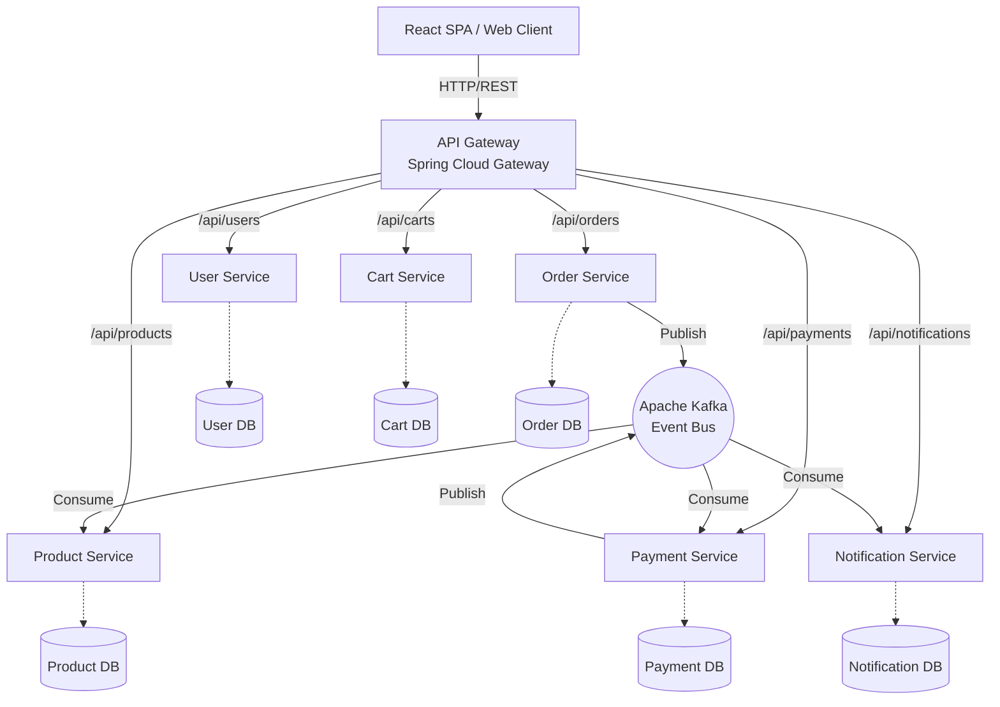

# High-Level System Architecture

This document illustrates the macro-level architecture of the E-Commerce platform. It follows an API Gateway pattern with asynchronous event streaming via Kafka.

## System Diagram

### Explanatory Notes
- **React → API Gateway**: The client interacts exclusively with the API Gateway, shielding internal service complexities.
- **API Gateway → Microservices**: Request routing, rate-limiting, and central JWT verification.
- **Kafka**: Used for decoupled, eventual consistency across services.
- **Databases**: Strict database-per-service isolation pattern using MySQL.
