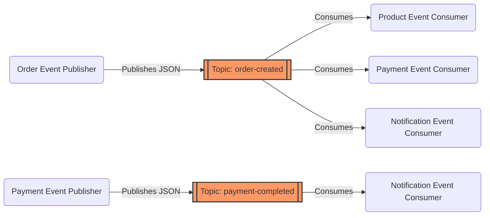

# Kafka Event Architecture

Apache Kafka acts as the central nervous system of the microservices platform, enabling highly decoupled, asynchronous workflows.

## Topics, Producers, and Consumers

### Event Contracts
All payloads are serialized as JSON. Strict POJO representation ensures compatibility between producers and consumers (e.g., `OrderCreatedEvent` payload).\n