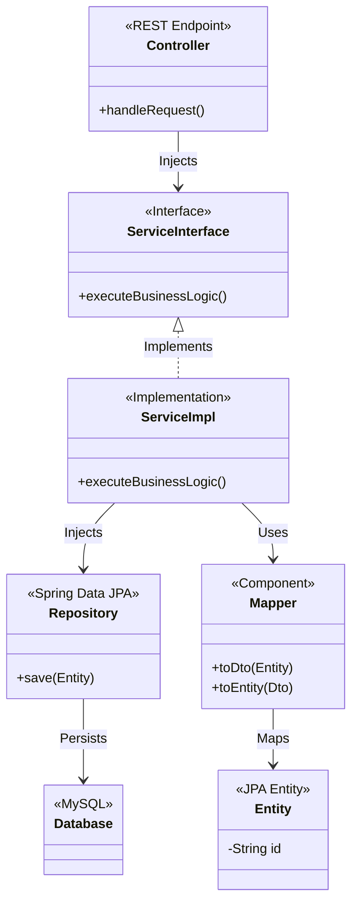

# Microservice Architecture

Each service within the platform is built on Spring Boot and follows a strict internal layered architecture.

## Common Architecture Diagram

## Service Responsibilities & Ownership

| Microservice | Primary Responsibility | Database Ownership | Dependencies |
|--------------|------------------------|--------------------|--------------|
| **User** | Authentication, JWT issuing, user profile management. | `user_db` | None |
| **Product** | Catalog browsing, inventory tracking. | `product_db` | Consumes `order-created` |
| **Cart** | Temporary storage of shopping session items. | `cart_db` | None |
| **Order** | Order creation, validation, and history management. | `order_db` | Publishes `order-created` |
| **Payment** | Processing financial transactions for orders. | `payment_db` | Consumes `order-created`, Publishes `payment-completed` |
| **Notification**| Asynchronous email/SMS notifications to users. | `notification_db` | Consumes `order-created`, `payment-completed` |\n