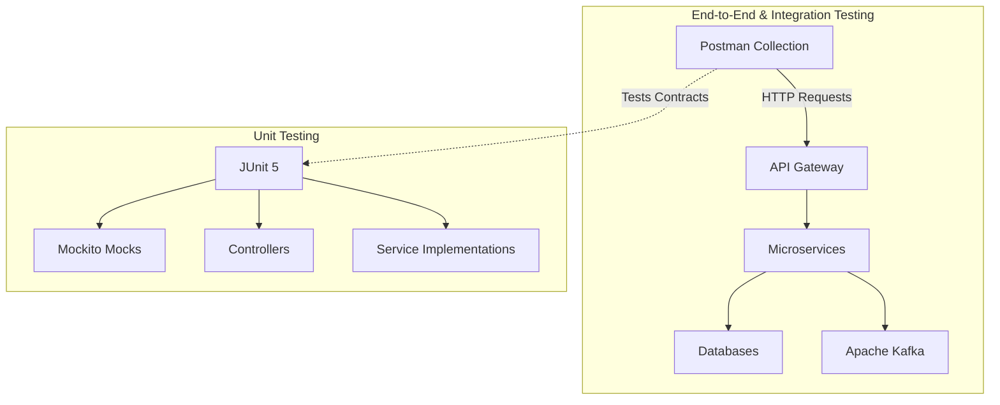

# Testing Architecture

The platform utilizes a comprehensive testing pyramid strategy.

### Components
- **Postman**: Automates E2E testing mimicking real frontend client behavior.
- **JUnit & Mockito**: Isolates logic for rapid, reliable unit testing inside the CI pipeline.
