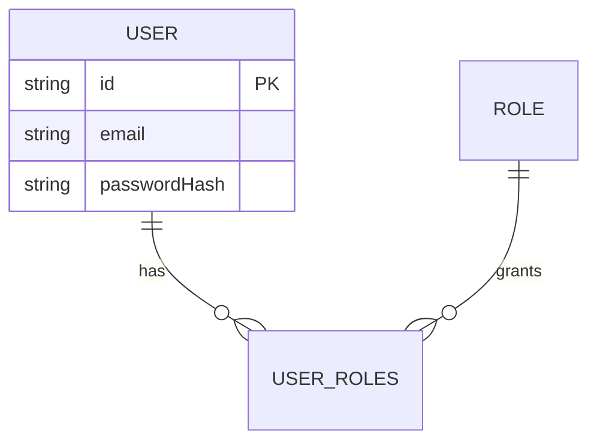

# ER Diagrams

Since this uses a Database-per-Service architecture, there is no single ER diagram. Instead, each database is localized.

```mermaid
erDiagram
    USER ||--o{ USER_ROLES : has
    ROLE ||--o{ USER_ROLES : grants
    USER {
        string id PK
        string email
        string passwordHash
    }
```
