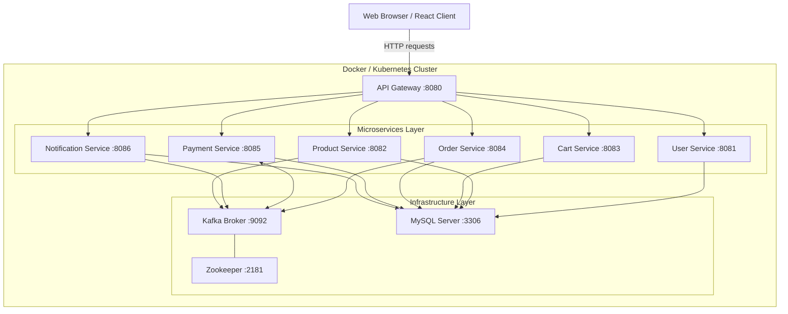

# Deployment Diagram

This illustrates the infrastructure topology of a containerized deployment.

```mermaid
graph TD
    Browser[Web Browser / React Client]
    
    subgraph Docker / Kubernetes Cluster
        Gateway[API Gateway :8080]
        
        subgraph Microservices Layer
            User[User Service :8081]
            Prod[Product Service :8082]
            Cart[Cart Service :8083]
            Order[Order Service :8084]
            Pay[Payment Service :8085]
            Notif[Notification Service :8086]
        end
        
        subgraph Infrastructure Layer
            Kafka[Kafka Broker :9092]
            Zookeeper[Zookeeper :2181]
            MySQL[MySQL Server :3306]
        end
    end
    
    Browser -->|HTTP requests| Gateway
    Gateway --> User
    Gateway --> Prod
    Gateway --> Cart
    Gateway --> Order
    Gateway --> Pay
    Gateway --> Notif
    
    Order --> Kafka
    Pay <--> Kafka
    Notif --> Kafka
    Prod --> Kafka
    Kafka --- Zookeeper
    
    User --> MySQL
    Prod --> MySQL
    Cart --> MySQL
    Order --> MySQL
    Pay --> MySQL
    Notif --> MySQL
```
