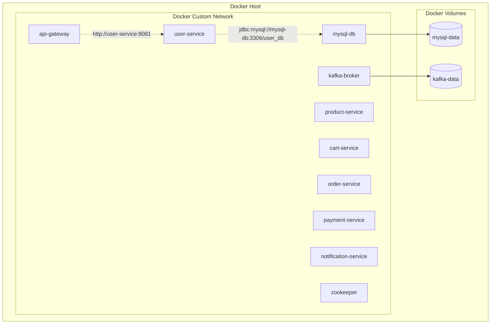

# Docker Architecture

The platform relies on containerization to ensure identical execution environments across local development and production.

### Explanatory Notes
- **Docker Network**: Services address each other using Docker container names (e.g., `mysql-db` instead of `localhost`).
- **Volumes**: Data stores (MySQL, Kafka) map to persistent Docker volumes to survive container restarts.
- **Ports**: Only the Gateway (`8080`) needs to be mapped to the host machine.
