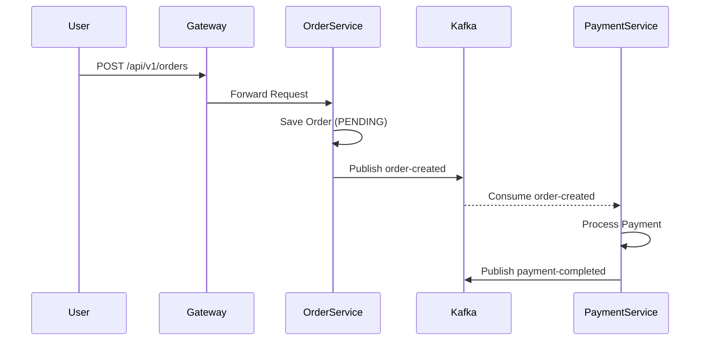

# Sequence Diagrams

## Order Checkout Sequence

```mermaid
sequenceDiagram
    participant User
    participant Gateway
    participant OrderService
    participant Kafka
    participant PaymentService

    User->>Gateway: POST /api/v1/orders
    Gateway->>OrderService: Forward Request
    OrderService->>OrderService: Save Order (PENDING)
    OrderService->>Kafka: Publish order-created
    Kafka-->>PaymentService: Consume order-created
    PaymentService->>PaymentService: Process Payment
    PaymentService->>Kafka: Publish payment-completed
```
