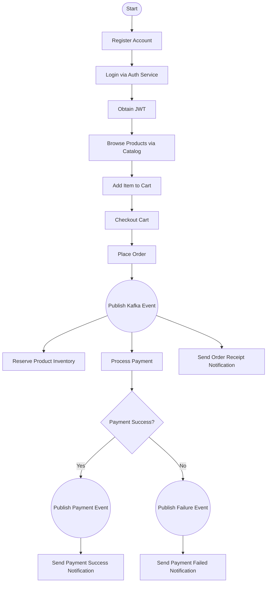

# End-to-End Business Flow

This flowchart illustrates the holistic user journey from registration to final notification.

```mermaid
flowchart TD
    A([Start]) --> B[Register Account]
    B --> C[Login via Auth Service]
    C --> D[Obtain JWT]
    D --> E[Browse Products via Catalog]
    E --> F[Add Item to Cart]
    F --> G[Checkout Cart]
    G --> H[Place Order]
    H --> I((Publish Kafka Event))
    
    I --> J[Reserve Product Inventory]
    I --> K[Process Payment]
    I --> L[Send Order Receipt Notification]
    
    K --> M{Payment Success?}
    M -->|Yes| N((Publish Payment Event))
    M -->|No| O((Publish Failure Event))
    
    N --> P[Send Payment Success Notification]
    O --> Q[Send Payment Failed Notification]
```
